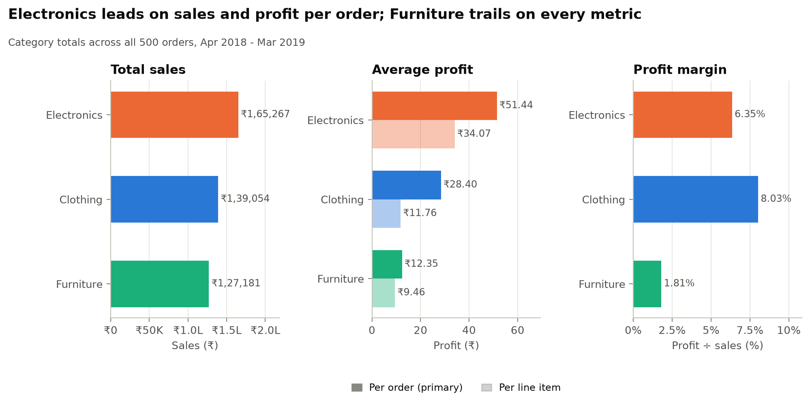
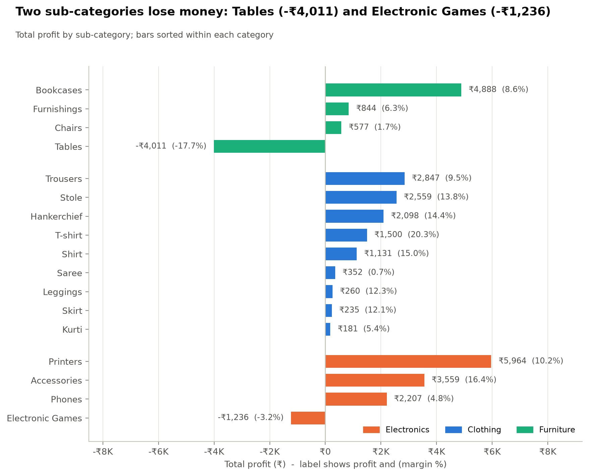
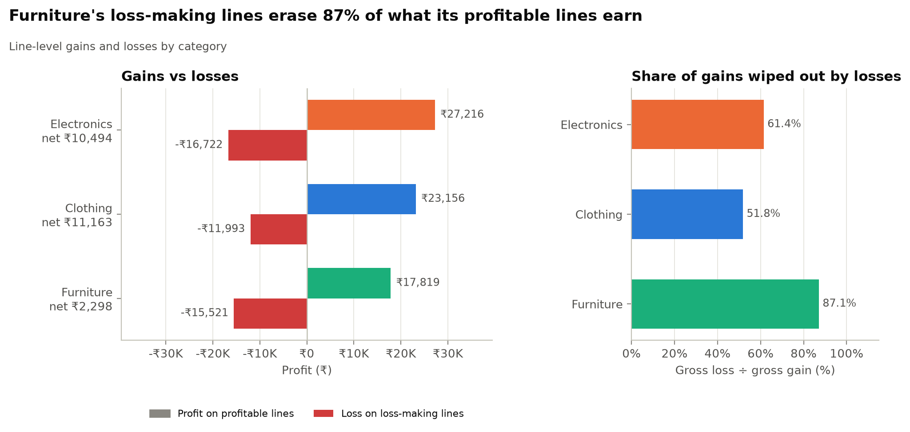
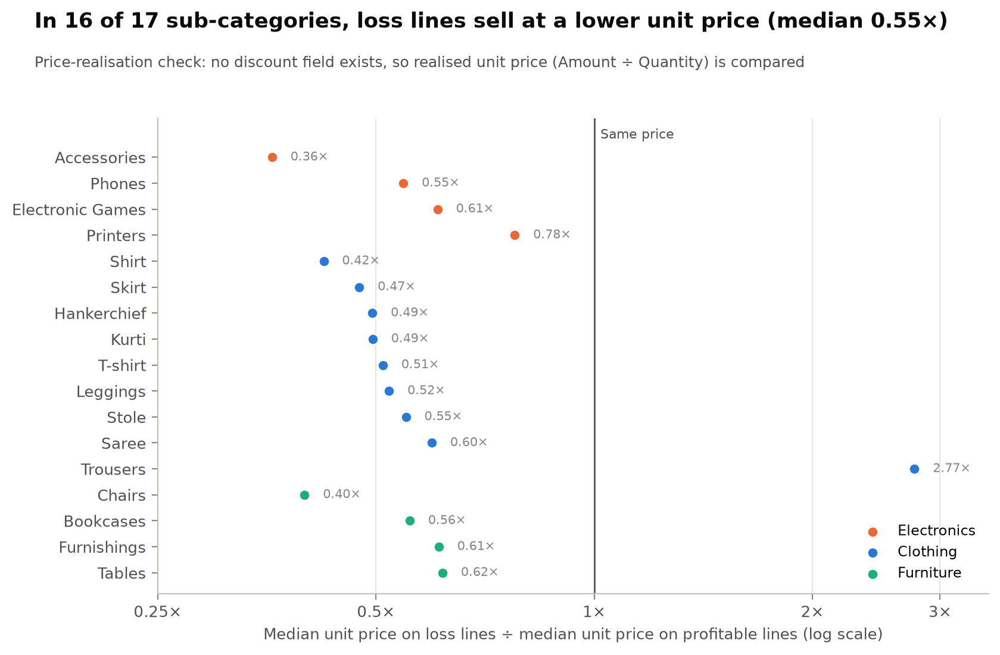
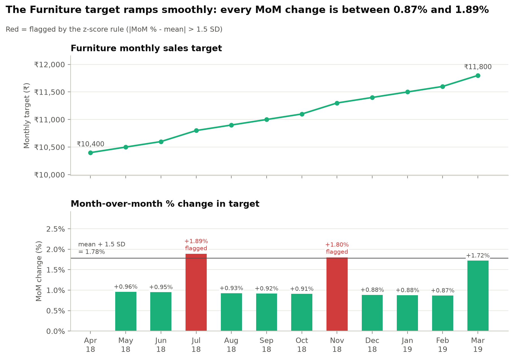
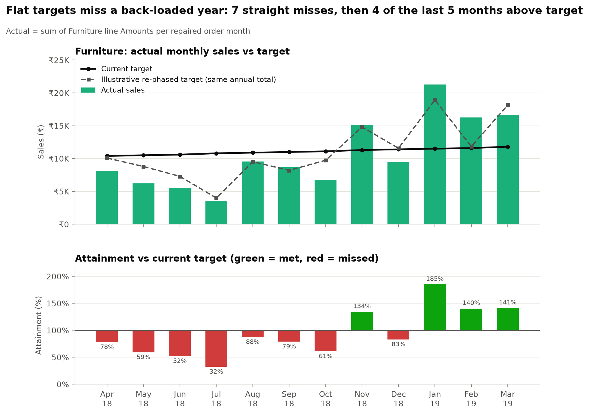
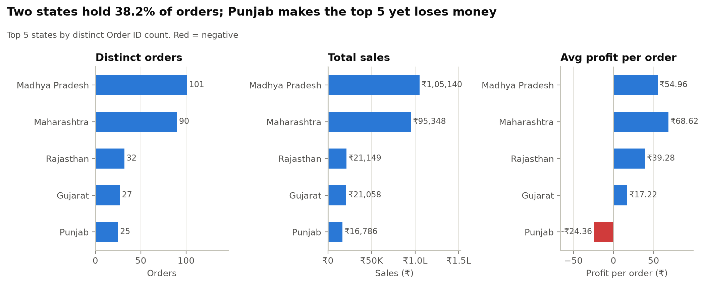
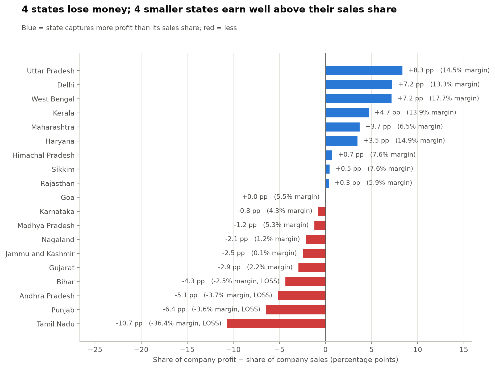
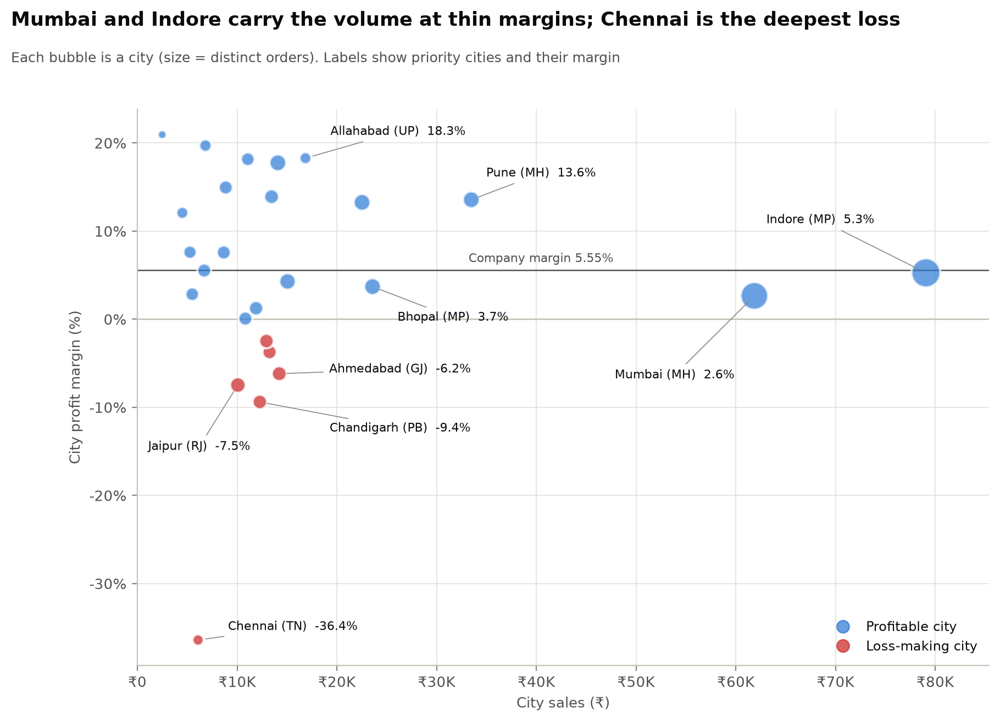
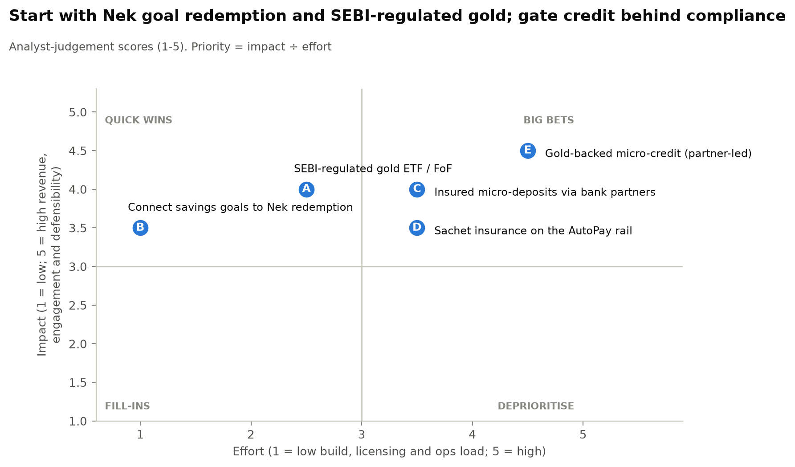

# Jar — Growth Intern Assignment

Sales analysis · App exploration · Product exploration

{{meta.author|raw}} · {{meta.date|raw}}

Code: {{meta.github|raw}}

## Executive summary

**Categories.** Electronics leads on sales ({{cat.Electronics.amount|inr}}, {{cat.Electronics.sales_share_pct|pct1}}) and profit per order ({{cat.Electronics.profit_per_order|inr2}}). Clothing earns the most profit ({{cat.Clothing.profit|inr}}) at the best margin ({{cat.Clothing.margin_pct|pct2}}). Furniture trails on every metric ({{cat.Furniture.margin_pct|pct2}} margin).

**Profit leaks.** Two sub-categories lose money: Tables ({{sub.Furniture.Tables.profit|inr}}) and Electronic Games ({{sub.Electronics.Electronic Games.profit|inr}}). In {{p1.price_n_lower|int}} of {{p1.price_n_subcats|int}} sub-categories, loss-making lines realise lower unit prices than profitable ones (median {{p1.price_median_ratio|x2}}) at the same quantity.

**Furniture targets.** The target ramps smoothly (no MoM move above {{p2.mom_max|pct2}}), but demand is back-loaded. Furniture missed target {{p2.lead_miss_months|int}} months in a row, then beat it in {{p2.tail_met|int}} of the last {{p2.tail_months|int}} ({{p2.attain_annual|pct1}} for the year). Seasonal phasing cuts monthly error from {{p2.mape_current|pct1}} to {{p2.mape_rephased_exfurn|pct1}} ({{p2.mape_rephased|pct1}} in-sample).

**Regions.** Madhya Pradesh and Maharashtra hold {{p3.top2_order_share|pct1}} of orders. Mumbai's margin is {{city.Mumbai@Maharashtra.margin_pct|pct2}}, against {{city.Pune@Maharashtra.margin_pct|pct2}} in Pune. {{p3.n_loss_states|int}} states lose money ({{p3.loss_states_total|inr}}), while {{p3.overearners|raw}} earn {{p3.overearners_profit_share|pct1}} of profit on {{p3.overearners_sales_share|pct1}} of sales.

**App (Q2).** The most serious issue is a silent failure: Nominee Details does nothing when tapped from Profile, though it works from a home-screen pop-up. Reward screens such as a spin wheel also interrupt users mid-task. Onboarding, AutoPay saving and buying and selling gold were smooth.

**Product (Q3).** Digital gold sits outside SEBI's oversight industry-wide (advisory, November 2025). Jar can lead the category by setting the disclosure standard and moving its automation onto regulated rails. The first moves are connecting existing goals to Nek redemption and a SEBI-regulated gold ETF/FoF, followed by insured deposits, sachet insurance and partner-led gold credit.

## 1. Data and method {: .cont }

### 1.1 Join validation

Order Details (one row per line item) is **left-joined** to List of Orders on Order ID with pandas `validate="many_to_one"` and an indicator column. Order Details carries the grain of every financial metric. The many-to-one check proves Order ID is unique on the header side, so the join cannot duplicate lines. A hard assertion fails the run on any orphan, instead of letting an inner join drop it silently.

| Check | Result |
|---|---|
| List of Orders rows / unique Order IDs | {{join.orders_rows|int}} / {{join.orders_unique_ids|int}} |
| Order Details rows / unique Order IDs | {{join.details_rows|int}} / {{join.details_unique_ids|int}} |
| Duplicate Order IDs in List of Orders | {{join.duplicate_ids_in_orders|int}} |
| IDs only in List of Orders / only in Order Details | {{join.ids_only_in_orders|int}} / {{join.ids_only_in_details|int}} |
| Rows after merge | {{join.merged_rows|int}} (equals line items) |

Orders have 1 to {{data.max_lines_per_order|int}} lines, and {{data.multi_category_orders|int}} span more than one category. That is why "per order" and "per line" averages differ.

### 1.2 Date repairs

Spreadsheet auto-conversion corrupted both date fields. Both were repaired in code, with assertions; the raw files are untouched.

- **Order Date.** {{data.text_dates|int}} cells are `dd-mm-yyyy` text. The other {{data.swapped_dates|int}} were read month-first, so day and month were swapped back. Repaired dates rise monotonically with the sequential Order ID and span {{data.date_min|raw}} to {{data.date_max|raw}}.
- **Sales Target month.** "Apr-18" had been stored as *18 April of the current year*, so year = 2000 + stored day. The months run April 2018 to March 2019, matching the order period exactly.

### 1.3 Definitions

- **Sales** = sum of `Amount`. **Margin** = sum(Profit) ÷ sum(Amount). **Order count** = distinct Order IDs.
- **Average profit per order (primary)** = group profit ÷ distinct orders containing the group. **Per line item** (secondary) = mean line profit. Both rank the categories identically; per-order values are {{p1.order_line_ratio_min|x1}}–{{p1.order_line_ratio_max|x1}} higher.
- **Price realisation.** The data has no discount field, so discounting can only be tested indirectly: realised unit price (Amount ÷ Quantity) on loss-making lines is compared with profitable lines in the same sub-category.

### 1.4 Sample size

The dataset is small: {{total.orders|int}} orders and {{total.lines|int}} lines over one year. Several cuts rest on few observations: Tables has {{sub.Furniture.Tables.lines|int}} lines, Tamil Nadu {{state.Tamil Nadu.orders|int}} orders, and Furniture sells {{p2.min_month_orders|int}}–{{p2.max_month_orders|int}} orders a month. A handful of large lines can move a sub-category, city or month. Category-level findings are robust. Single-city and single-month results are directional and should be confirmed with more data before acting.

## 2. Q1 Part 1 — Sales and profitability {: .cont }

### 2.1 Category scorecard

Figure 1. Category totals: sales, average profit (per order and per line) and margin.
{: .caption}

| Category | Sales | Share of sales | Profit | Share of profit | Profit / order | Profit / line | Margin |
|---|---:|---:|---:|---:|---:|---:|---:|
| Electronics | {{cat.Electronics.amount|inr}} | {{cat.Electronics.sales_share_pct|pct1}} | {{cat.Electronics.profit|inr}} | {{cat.Electronics.profit_share_pct|pct1}} | {{cat.Electronics.profit_per_order|inr2}} | {{cat.Electronics.profit_per_line|inr2}} | {{cat.Electronics.margin_pct|pct2}} |
| Clothing | {{cat.Clothing.amount|inr}} | {{cat.Clothing.sales_share_pct|pct1}} | {{cat.Clothing.profit|inr}} | {{cat.Clothing.profit_share_pct|pct1}} | {{cat.Clothing.profit_per_order|inr2}} | {{cat.Clothing.profit_per_line|inr2}} | {{cat.Clothing.margin_pct|pct2}} |
| Furniture | {{cat.Furniture.amount|inr}} | {{cat.Furniture.sales_share_pct|pct1}} | {{cat.Furniture.profit|inr}} | {{cat.Furniture.profit_share_pct|pct1}} | {{cat.Furniture.profit_per_order|inr2}} | {{cat.Furniture.profit_per_line|inr2}} | {{cat.Furniture.margin_pct|pct2}} |
| **Total** | **{{total.sales|inr}}** | 100% | **{{total.profit|inr}}** | 100% | | | **{{total.margin|pct2}}** |

**Verdict.**

- **Electronics leads on scale and order economics:** #1 on sales and on profit per order.
- **Clothing leads on efficiency:** #1 on total profit and on margin. Its per-line profit ({{cat.Clothing.profit_per_line|inr2}}) understates it, because its lines are small (unit price {{cat.Clothing.unit_price|inr2}}). It also appears in {{cat.Clothing.orders|int}} of {{total.orders|int}} orders, the most of any category.
- **Furniture underperforms:** last on all four metrics.

### 2.2 Why the categories differ

**1. One or two sub-categories hold each category back.**

Figure 2. Profit and margin by sub-category.
{: .caption}

- **Furniture.** Tables lose {{sub.Furniture.Tables.profit|inr}} on {{sub.Furniture.Tables.amount|inr}} ({{sub.Furniture.Tables.margin_pct|pct1}} margin; {{sub.Furniture.Tables.loss_line_share_pct|pct1}} of lines in loss). Chairs barely break even ({{sub.Furniture.Chairs.margin_pct|pct1}}). Bookcases earn {{sub.Furniture.Bookcases.profit|inr}}, which is {{sub.Furniture.Bookcases.share_of_cat_profit_pct|pct0}} of Furniture's net profit. Without Tables, the margin would be {{p1.furn_ex_tables_margin|pct2}}, close to Electronics ({{cat.Electronics.margin_pct|pct2}}).
- **Electronics.** Electronic Games lose {{sub.Electronics.Electronic Games.profit|inr}} ({{sub.Electronics.Electronic Games.margin_pct|pct1}}), and Phones earn {{sub.Electronics.Phones.margin_pct|pct1}} with {{sub.Electronics.Phones.loss_line_share_pct|pct1}} of lines in loss. Printers ({{sub.Electronics.Printers.share_of_cat_profit_pct|pct1}} of category profit) and Accessories ({{sub.Electronics.Accessories.margin_pct|pct1}} margin) carry the category. Without Games, the margin would be {{p1.elec_ex_games_margin|pct2}}.
- **Clothing.** Sarees are {{sub.Clothing.Saree.share_of_cat_sales_pct|pct1}} of sales at a {{sub.Clothing.Saree.margin_pct|pct2}} margin. The rest of Clothing earns {{p1.cloth_ex_saree_margin|pct1}}.

**2. Losses are concentrated, most severely in Furniture.**

Figure 3. Gross gains from profitable lines vs gross losses from loss-making lines.
{: .caption}

| Category | Lines in loss | Loss ÷ gain | Worst {{meta.top_n_loss|raw}} lines' share of losses | Lines losing more than their revenue |
|---|---:|---:|---:|---:|
| Electronics | {{loss.Electronics.loss_line_share_pct|pct1}} | {{loss.Electronics.loss_to_gain_pct|pct1}} | {{loss.Electronics.top_n_loss_share_pct|pct1}} | {{loss.Electronics.loss_exceeds_revenue_lines|int}} |
| Clothing | {{loss.Clothing.loss_line_share_pct|pct1}} | {{loss.Clothing.loss_to_gain_pct|pct1}} | {{loss.Clothing.top_n_loss_share_pct|pct1}} | {{loss.Clothing.loss_exceeds_revenue_lines|int}} |
| Furniture | {{loss.Furniture.loss_line_share_pct|pct1}} | {{loss.Furniture.loss_to_gain_pct|pct1}} | {{loss.Furniture.top_n_loss_share_pct|pct1}} | {{loss.Furniture.loss_exceeds_revenue_lines|int}} |

Furniture's loss-making lines give back {{loss.Furniture.gross_loss|inr}} of the {{loss.Furniture.gross_gain|inr}} its profitable lines earn. Its worst {{meta.top_n_loss|raw}} lines account for {{loss.Furniture.top_n_loss_share_pct|pct1}} of those losses.

**3. Loss-making lines realise lower prices, not smaller quantities.**

Figure 4. Median unit price on loss-making vs profitable lines within each sub-category.
{: .caption}

In {{p1.price_n_lower|int}} of {{p1.price_n_subcats|int}} sub-categories, loss-making lines sell at a lower median unit price than profitable ones (median ratio {{p1.price_median_ratio|x2}}; Chairs {{price.Chairs.ratio|x2}}). The exception is {{p1.price_exception|raw}} ({{p1.price_exception_ratio|x2}}), where losses sit on high-ticket lines, which suggests a cost problem. Median quantity is the same on both ({{p1.qty_median_loss|f0}} units), so the losses track **low realised prices**, not volume.

The data cannot say *why* prices are low. Discounting (the same item sold for less) is one hypothesis. **Product mix** is the alternative: cheaper variants within a sub-category may carry thin or negative margins. Separating the two needs SKU-level list prices.

**4. Furniture keeps little profit per unit.** Furniture and Electronics sell at similar unit prices ({{cat.Furniture.unit_price|inr2}} vs {{cat.Electronics.unit_price|inr2}}). Furniture keeps {{cat.Furniture.profit_per_unit|inr2}} per unit against {{cat.Electronics.profit_per_unit|inr2}} for Electronics, so a small price concession tips a Furniture line into loss.

**Actions.**

1. Pull SKU-level list prices to test whether losses are discount-driven or mix-driven.
2. If discount-driven, set price floors on Tables and Chairs and a floor on Saree realised prices. If mix-driven, re-cost or prune the loss-making variants instead.
3. Re-price or delist Electronic Games.

## 3. Q1 Part 2 — Target achievement (Furniture) {: .cont }

### 3.1 Month-over-month change in target

Figure 5. Furniture monthly target and its month-over-month % change.
{: .caption}

**Fluctuation rule.** A month is flagged when its MoM % lies more than {{p2.z|f1}} standard deviations from the series mean (z-score; threshold {{p2.z_upper|pct2}}). As a materiality cross-check, it is also flagged if |MoM| ≥ {{p2.material_pct|pct0}}.

{{table:mom}}

The target rises {{p2.target_growth_pct|pct1}} across the year, in steps of {{p2.step_small|inr}}, with {{p2.step_large|inr}} steps in {{p2.step200_months|raw}}. The z-rule flags **{{p2.flagged_months|raw}}**, with {{p2.near_miss_month|raw}} just under the bar. The materiality rule flags **{{p2.n_material|int}} months**. The target's fluctuations are statistically visible but commercially trivial. The problem is a target *too smooth* for a volatile business.

### 3.2 Target vs actual

Figure 6. Actual Furniture sales vs current and illustrative re-phased target, and monthly attainment.
{: .caption}

- **Annually about right:** {{p2.actual_annual|inr}} achieved against {{p2.target_annual|inr}} ({{p2.attain_annual|pct1}}).
- **Monthly, phased wrong.** Target was met in only {{p2.months_met|int}} of 12 months. Furniture missed for {{p2.lead_miss_months|int}} straight months to {{p2.lead_miss_end|raw}} ({{p2.lead_miss_attain|pct1}} attainment, {{p2.lead_miss_gap|inr}}). It then beat target in {{p2.tail_met|int}} of the last {{p2.tail_months|int}} ({{p2.tail_attain|pct1}}, +{{p2.tail_gap|inr}}).
- **H1 over-weighted.** April–September carries {{p2.h1_share_target|pct1}} of the target but only {{p2.h1_share_actual|pct1}} of actual sales.
- **Actuals are {{p2.cv_ratio|x1}} more volatile than the target.** The coefficient of variation is {{p2.actual_cv|pct1}} for actuals vs {{p2.target_cv|pct1}} for the target.
- **Revenue-only targets hide losses.** Furniture lost money in {{p2.loss_months|int}} months ({{p2.loss_months_loss|inr}} in total).

### 3.3 Aligning targets with performance

1. **Phase by seasonality.** Spread the same {{p2.target_annual|inr}} across months by each month's share of company-wide sales. The monthly target then ranges from {{p2.rephased_min|inr}} ({{p2.rephased_min_month|raw}}) to {{p2.rephased_max|inr}} ({{p2.rephased_max_month|raw}}). MAPE falls from {{p2.mape_current|pct1}} to {{p2.mape_rephased|pct1}}, and months within ±{{p2.band|pct0}} of target rise from {{p2.current_months_within_band|int}} to {{p2.rephased_months_within_band|int}}.
    - {{p2.mape_rephased|pct1}} is optimistic: company sales include Furniture itself ({{cat.Furniture.sales_share_pct|pct1}} of the total), and seasonality comes from the same year. With Clothing and Electronics alone, which excludes Furniture entirely, MAPE is {{p2.mape_rephased_exfurn|pct1}}, the better estimate. In practice, phase on prior-year or rolling three-year shares.
2. **Add a margin guardrail** (e.g. margin ≥ 0% each month), and tie price approvals on Tables and Chairs to it.
3. **Use a ±{{p2.band|pct0}} band and re-forecast quarterly.** With an actual CV of {{p2.actual_cv|pct0}}, a point target will be missed almost every month.
4. **Re-balance across categories.** Electronics hit {{att.Electronics.annual_attainment_pct|pct1}} of target and Clothing {{att.Clothing.annual_attainment_pct|pct1}}. Shift ambition toward demonstrated run-rates.

## 4. Q1 Part 3 — Regional performance {: .cont }

### 4.1 Top 5 states by order count

Figure 7. Top 5 states by distinct orders: order count, total sales and average profit per order.
{: .caption}

| Rank | State | Distinct orders | Total sales | Total profit | Avg profit / order | Avg profit / line | Margin |
|---:|---|---:|---:|---:|---:|---:|---:|
| 1 | {{top.1|raw}} | {{state.Madhya Pradesh.orders|int}} | {{state.Madhya Pradesh.sales|inr}} | {{state.Madhya Pradesh.profit|inr}} | {{state.Madhya Pradesh.profit_per_order|inr2}} | {{state.Madhya Pradesh.profit_per_line|inr2}} | {{state.Madhya Pradesh.margin_pct|pct2}} |
| 2 | {{top.2|raw}} | {{state.Maharashtra.orders|int}} | {{state.Maharashtra.sales|inr}} | {{state.Maharashtra.profit|inr}} | {{state.Maharashtra.profit_per_order|inr2}} | {{state.Maharashtra.profit_per_line|inr2}} | {{state.Maharashtra.margin_pct|pct2}} |
| 3 | {{top.3|raw}} | {{state.Rajasthan.orders|int}} | {{state.Rajasthan.sales|inr}} | {{state.Rajasthan.profit|inr}} | {{state.Rajasthan.profit_per_order|inr2}} | {{state.Rajasthan.profit_per_line|inr2}} | {{state.Rajasthan.margin_pct|pct2}} |
| 4 | {{top.4|raw}} | {{state.Gujarat.orders|int}} | {{state.Gujarat.sales|inr}} | {{state.Gujarat.profit|inr}} | {{state.Gujarat.profit_per_order|inr2}} | {{state.Gujarat.profit_per_line|inr2}} | {{state.Gujarat.margin_pct|pct2}} |
| 5 | {{top.5|raw}} | {{state.Punjab.orders|int}} | {{state.Punjab.sales|inr}} | {{state.Punjab.profit|inr}} | {{state.Punjab.profit_per_order|inr2}} | {{state.Punjab.profit_per_line|inr2}} | {{state.Punjab.margin_pct|pct2}} |

*Average profit is **per order** (state profit ÷ distinct orders); per-line is shown for reference.* There is no tie at the cut-off: the next states ({{p3.next_states|raw}}) have {{p3.next_orders|int}} orders each. The top 5 hold {{p3.top5_order_share|pct1}} of orders and {{p3.top5_sales_share|pct1}} of sales, but only {{p3.top5_profit_share|pct1}} of profit.

### 4.2 Regional disparities

Figure 8. Each state's share of company profit minus its share of company sales.
{: .caption}

- **Sales-to-profit mismatch.** Madhya Pradesh has {{state.Madhya Pradesh.sales_share_pct|pct1}} of sales but {{state.Madhya Pradesh.profit_share_pct|pct1}} of profit. {{p3.overearners|raw}} earn {{p3.overearners_profit_share|pct1}} of profit on {{p3.overearners_sales_share|pct1}} of sales, a {{p3.overearners_margin|pct1}} margin against {{total.margin|pct2}} for the company.
- **Loss-making states, each driven by one category.**
    - Tamil Nadu: {{state.Tamil Nadu.profit|inr}}, from Furniture.
    - Punjab: {{state.Punjab.profit|inr}}, from Electronics ({{stcat.Punjab.Electronics.profit|inr}}).
    - Andhra Pradesh: {{state.Andhra Pradesh.profit|inr}}, from Furniture.
    - Bihar: {{state.Bihar.profit|inr}}, from Electronics.
- **City-level splits.** In {{p3.loss_cities_top5_states|raw}}, one city makes money and the other loses it:

| State | Loss-making city | Sales | Profit | Margin | Profitable city | Margin |
|---|---|---:|---:|---:|---|---:|
| Gujarat | Ahmedabad | {{city.Ahmedabad@Gujarat.sales|inr}} | {{city.Ahmedabad@Gujarat.profit|inr}} | {{city.Ahmedabad@Gujarat.margin_pct|pct1}} | Surat | {{city.Surat@Gujarat.margin_pct|pct1}} |
| Punjab | Chandigarh | {{city.Chandigarh@Punjab.sales|inr}} | {{city.Chandigarh@Punjab.profit|inr}} | {{city.Chandigarh@Punjab.margin_pct|pct1}} | Amritsar | {{city.Amritsar@Punjab.margin_pct|pct1}} |
| Rajasthan | Jaipur | {{city.Jaipur@Rajasthan.sales|inr}} | {{city.Jaipur@Rajasthan.profit|inr}} | {{city.Jaipur@Rajasthan.margin_pct|pct1}} | Udaipur | {{city.Udaipur@Rajasthan.margin_pct|pct1}} |

Figure 9. City sales vs margin; bubble size is distinct orders.
{: .caption}

### 4.3 Where to focus

| Priority | Where | Why (number) | Lever |
|---|---|---|---|
| 1. Margin repair at scale | **Mumbai** | {{city.Mumbai@Maharashtra.sales|inr}} at {{city.Mumbai@Maharashtra.margin_pct|pct2}}; {{city.Mumbai@Maharashtra.loss_line_share_pct|pct1}} of lines in loss vs {{city.Pune@Maharashtra.loss_line_share_pct|pct1}} in Pune | Pune's margin would add about {{p3.mumbai_uplift_pune|inr}}; the company average, {{p3.mumbai_uplift_company|inr}} |
| 2. Investigate | **Chennai (Tamil Nadu)** | {{city.Chennai@Tamil Nadu.profit|inr}} on {{city.Chennai@Tamil Nadu.sales|inr}} ({{city.Chennai@Tamil Nadu.margin_pct|pct1}}) from only {{city.Chennai@Tamil Nadu.orders|int}} orders | Find what drives the Furniture loss ({{stcat.Tamil Nadu.Furniture.profit|inr}}): pricing, freight or one-off returns. Act once the cause is confirmed |
| 3. Fix loss cities in the top 5 | **{{p3.loss_cities_top5_names|raw}}** | {{p3.loss_cities_top5|inr}} combined; sister cities earn double-digit margins | Copy the sister city's mix and pricing; for Punjab, start with Electronics |
| 4. Defend the volume base | **Indore, Bhopal** | Indore is {{city.Indore@Madhya Pradesh.share_of_state_sales_pct|pct1}} of Madhya Pradesh sales; Bhopal earns {{city.Bhopal@Madhya Pradesh.margin_pct|pct1}} | Hold Indore near the company margin; lift Bhopal |
| 5. Grow where profit is easy | **Allahabad, Delhi, Kolkata, Thiruvananthapuram** | {{p3.overearners_margin|pct1}} combined margin on only {{p3.overearners_orders|int}} orders | Spend acquisition budget here first |

*Data note:* {{data.delhi_in_mp|int}} orders list city "Delhi" under Madhya Pradesh; they are kept as recorded and change no ranking. Chandigarh appears under both Punjab ({{data.chandigarh_pb|int}} orders) and Haryana ({{data.chandigarh_hr|int}}).

## 5. Q2 — App exploration

**Test setup.** Hands-on session on a Vivo T2x 5G (6 GB RAM) over Jio 5G. Jar blocks screenshots, a standard security measure in fintech apps, so observations are described rather than shown.

### 5.1 Five things that work well

| # | What I observed | Why it works (UX principle) |
|---|---|---|
| 1 | **Onboarding was simple.** | *Low onboarding friction.* For first-time savers, every step removed before the first saving raises the share who get there. |
| 2 | **Daily savings on AutoPay worked smoothly, and a goals feature exists.** | *Habit loop and default effect.* A one-time mandate replaces a daily decision, so saving runs without willpower. Goals give the habit a purpose. |
| 3 | **Buying and selling gold was smooth.** | *Reversibility lowers perceived risk.* Users commit money more readily when getting it back is easy. |
| 4 | **The payment screen carries a trust line: "100% safe and secure payments".** | *Trust signals in fintech.* Reassurance at the moment of payment is well placed. But it addresses payment security, not where the gold is held. Showing the vault partner (Brink's), trustee (Vistra) and insurer (ICICI Lombard) here would answer the question users actually have. The website names all three, but the insurer appears only in its body text; its "100% Insured" badge does not name it. |
| 5 | **Engagement is strong, with multiple reward mechanics.** | *Variable rewards.* Rewards give users a reason to open the app between savings and reinforce the daily habit. Their cost is covered in 5.2 #2. |

### 5.2 Five areas to improve

| # | What I observed | Why it matters (UX principle) and what to change |
|---|---|---|
| 1 | **Nominee Details is unresponsive from the Profile section.** Tapping it does nothing, with no error or feedback. The same flow works from the home-screen pop-up, so one entry point is broken. This is the most serious finding. | *Visibility of system status; error recovery* (Nielsen). A silent failure leaves users unsure whether anything happened. Here it blocks a basic safeguard for a financial asset, naming who inherits the gold, at the place users expect to find it. Fix the Profile entry point, and give every action that can fail an explicit error state. |
| 2 | **Reward screens interrupt intent.** While I was trying to do something else, a spin wheel appeared first. The multiple reward surfaces also make the app feel cluttered. | *Task completion vs interruption.* Engagement mechanics are competing with what the user came to do. Show rewards after a task is done, not before it, and consolidate them into fewer surfaces. |
| 3 | **Several screens load slowly**, despite a capable device on 5G. | *Perceived performance.* In a money app, slow screens read as unreliability. A capable device on 5G rules out the obvious causes on the user's side, which points to the app. Prioritise the saving and payment flows. |
| 4 | **Visual polish.** Several graphics are blurry, and the loader looks unrefined. | *Aesthetic-usability effect.* Users read polish as care. In a product that holds their money, rough visuals quietly erode trust. |
| 5 | **No global search across features.** | *Information scent and findability.* As the feature set grows (savings, goals, rewards, Nek), features get harder to find. Search would also reduce reliance on home-screen pop-ups to surface them. |

## 6. Q3 — Product exploration

### 6.1 Starting point: Jar's strengths and the category's open gap

Jar's moat is behavioural. It has (i) **automation**: UPI AutoPay mandates across more than {{q3.registered_users|mn}} registered users; (ii) **micro-ticket access** at ₹10; (iii) **UX simplicity**, in nine languages, for a base that is about 60% tier-2/3; and (iv) **established credibility with first-time savers**, backed by a vault partner (Brink's) and trustee (Vistra) shown in its website's "Secured by" badge, and an insurer (ICICI Lombard) named in the website's body text.

The category has an open gap that every platform shares. SEBI's advisory of 8 November 2025 noted that digital gold is neither a security nor a regulated commodity derivative, so it sits outside SEBI's oversight. Industry voices have since called for standardised disclosure of storage, fees, redemption and insurance. Jar is best placed to lead here. It already names its custody, insurance and trustee partners on its website, and it has the scale to set a disclosure standard others follow. Leading on transparency in digital gold, while extending its automation onto regulated rails, both deepens Jar's credibility and opens new revenue.

Figure 10. Effort vs impact for the five opportunities (analyst-judgement scores, 1–5).
{: .caption}

| Rank | Opportunity | Impact | Effort | Quadrant | Horizon |
|---:|---|---:|---:|---|---|
| {{opp.B.rank|int}} | B. {{opp.B.name|raw}} | {{opp.B.impact|f1}} | {{opp.B.effort|f1}} | {{opp.B.quadrant|raw}} | {{opp.B.horizon|raw}} |
| {{opp.A.rank|int}} | A. {{opp.A.name|raw}} | {{opp.A.impact|f1}} | {{opp.A.effort|f1}} | {{opp.A.quadrant|raw}} | {{opp.A.horizon|raw}} |
| {{opp.C.rank|int}} | C. {{opp.C.name|raw}} | {{opp.C.impact|f1}} | {{opp.C.effort|f1}} | {{opp.C.quadrant|raw}} | {{opp.C.horizon|raw}} |
| {{opp.D.rank|int}} | D. {{opp.D.name|raw}} | {{opp.D.impact|f1}} | {{opp.D.effort|f1}} | {{opp.D.quadrant|raw}} | {{opp.D.horizon|raw}} |
| {{opp.E.rank|int}} | E. {{opp.E.name|raw}} | {{opp.E.impact|f1}} | {{opp.E.effort|f1}} | {{opp.E.quadrant|raw}} | {{opp.E.horizon|raw}} |

### 6.2 Opportunity cards

**A. SEBI-regulated gold ETF / fund-of-funds — the defensive priority**

- **What it is.** A SEBI-regulated gold ETF or gold fund-of-funds, held in the user's own name. This is distinct from Jar's existing digital-gold SIP and daily saving, which buy unregulated digital gold.

- **User problem.** Savers who want gold *with* investor protection don't know how to buy an ETF.
- **Why Jar wins.** It already holds the AutoPay mandate and the gold-saving intent. A "Gold+ (SEBI-regulated)" option moves an existing habit rather than acquiring a new customer. Low-ticket mutual-fund SIPs (₹100–500 at many AMCs) fit Jar's micro-ticket DNA.
- **Integration path.** Become a mutual-fund distributor, or partner with a registered platform → add a second "jar" on the home card → route new savings there, with a cost comparison shown.
- **Monetisation.** Distribution trail on regular plans, or a platform fee on direct plans. Lower per-rupee take than the digital-gold spread, but recurring and defensible.
- **Sizing (back-of-envelope).** 35 million is *registered* users, and Jar does not publish its active base, so assume {{q3.active_share_pct|pct0}} are active savers ({{q3.active_users|lakh}}).
    - *New revenue:* if {{q3.A.adoption_pct|pct0}} of active savers ({{q3.A.users|lakh}}) invest ₹{{q3.A.monthly_sip|f0}} a month in it, that is about {{q3.A.inflow|cr0}} of regulated inflow in year one. At an indicative {{q3.A.trail_pct|pct1}} annual trail, the book earns a year-end run-rate of about {{q3.A.trail_revenue|cr2}} a year.
    - *Retention:* FY25 operating revenue of about {{q3.core_revenue|cr0}} works out to roughly {{q3.rev_per_active|inr}} per active saver a year. If a regulated option cuts annual churn by {{q3.A.churn_cut_pp|f0}} percentage points, it keeps {{q3.A.retained_users|lakh}} savers and about {{q3.A.retained_revenue|cr2}} a year.
    - *Total:* about {{q3.A.total_revenue|cr2}} a year, or {{q3.A.share_of_core_pct|pct1}} of FY25 operating revenue.
- **Why impact is {{opp.A.impact|f1}}.** The quantified value is material but not the largest on the list. The rest is defensibility: keeping the gold habit, and its AutoPay mandate, inside Jar for savers who want investor protection. That is real but hard to size.
- **Key risk.** Cannibalising the digital-gold spread; distributor conduct rules (suitability, commission disclosure).
- **Success metric.** Share of active savers holding the SEBI-regulated product within 6 months; regulated share of gold AUM.

**B. Connect savings goals to Nek redemption — the quick win**

- **User problem.** Households save for jewellery around weddings, Akshaya Tritiya and Dhanteras, often through jeweller 11-month schemes that lock money to one store.
- **Why Jar wins.** Jar already has a goals feature and its own jewellery brand, Nek. Connecting them turns a completed goal into a purchase the user has been working toward.
- **Integration path.** Goal completion → one-tap Nek purchase, with a making-charge discount for completed goals. Both pieces exist, so the build is the connection, not a new product.
- **Monetisation.** Nek margin and making charges. CAC is lower because the buyer is pre-funded and pre-committed.
- **Sizing (back-of-envelope).** On the same assumed active base ({{q3.active_users|lakh}}), say {{q3.B.goal_pct|pct0}} of active savers ({{q3.B.users|lakh}}) save toward a jewellery goal averaging ₹{{q3.B.avg_goal|int}}, and {{q3.B.redeem_pct|pct0}} complete and redeem at Nek. That gives about {{q3.B.orders|lakh}} orders and {{q3.B.gmv|cr0}} of GMV.
    - *Margin:* at an assumed {{q3.B.gross_margin_pct|pct0}} gross margin on jewellery, that is about {{q3.B.margin|cr1}}.
- **Key risk.** Must be framed as accumulation of the user's own gold, not a deposit scheme. Fulfilment quality at Nek.
- **Success metric.** Share of completed goals redeemed at Nek; 12-month retention of goal vs non-goal savers.

**C. Insured micro-deposits via bank partners**

- **User problem.** First-time savers want a safe, fixed-return home for emergency money, and bank FDs feel out of reach.
- **Why Jar wins.** The same mandate rail can sweep daily ₹10s into an RD or FD at partner small finance banks. Jar already works with Unity Small Finance Bank for UPI. DICGC insurance up to ₹5 lakh per depositor per bank is a regulated trust anchor Jar can explain simply.
- **Integration path.** Bank-partner FD/RD marketplace → a "safe jar" next to the gold jar → auto-split rules (e.g., 70% gold, 30% deposit).
- **Monetisation.** Distribution fee from partner banks; cross-sell lift.
- **Key risk.** Partner concentration; outsourcing and KYC obligations; keeping deposit messaging separate from gold.
- **Success metric.** Deposit balance per active saver; share of savers holding both gold and a deposit.

**D. Sachet insurance on the AutoPay rail**

- **User problem.** Tier-2/3 and gig workers are under-insured. Annual premiums feel large; ₹2–5 a day does not.
- **Why Jar wins.** Daily auto-debit is exactly how sachet premiums need to be collected, and Jar's plain-language style suits explaining cover.
- **Integration path.** IRDAI corporate-agent licence or broker partner → add-on toggles (personal accident, hospital cash) when a saving streak is set up.
- **Monetisation.** Commission within IRDAI expense limits.
- **Key risk.** Mis-selling or claim rejections would erode the core trust asset.
- **Success metric.** Attach rate; claim turnaround; 13-month persistency.

**E. Gold-backed micro-credit (partner-led) — gated**

- **User problem.** Small emergencies are funded by informal lenders, or by selling gold at a bad moment.
- **Why Jar wins.** The collateral is already vaulted and valued daily, so a small loan needs no branch visit or assayer.
- **Integration path.** Jar as lending service provider to an RBI-regulated bank or NBFC → "borrow instead of sell" offered on the sell screen.
- **Monetisation.** Sourcing fee or revenue share on disbursals.
- **Key risk.** The highest regulatory load of the five: digital-lending and gold-loan rules, plus the open question of pledging *digital* gold as collateral. Start only after the regulated rails (A, C) are live.
- **Success metric.** Loans per 1,000 active savers; 90+ day delinquency; share of borrowers who keep saving.

**Deprioritised.** Digital silver (same regulatory exposure, little new value); B2B payroll saving (long sales cycles).

### 6.3 Sequenced roadmap

| Horizon | Moves | Milestone |
|---|---|---|
| 0–6 months | B (goals → Nek) and A (SEBI-regulated gold ETF/FoF); publish a digital-gold disclosure standard | Regulated product live; first goal cohorts redeemed at Nek |
| 6–15 months | C (insured deposits), then D (sachet insurance) | Majority of new savings on regulated or insured rails |
| 12+ months, gated | E (gold-backed credit) via a regulated partner | Clean compliance; delinquency within plan |

### 6.4 Sources (Section 6)

TechCrunch, "Indian fintech Jar turns profitable by helping millions save in gold", 18 Sep 2025: users, tier-2/3 share, languages. · Entrackr, "Jar clocks Rs 208 Cr operating revenue in FY25, turns profitable in H2", 19 Sep 2025: FY25 operating revenue. · Jar website (myjar.app): Brink's (vault) and Vistra (trustee) in the "Secured by" badge; ICICI Lombard named as insurer in body text, not on the "100% Insured" badge. Accessed Oct 2026. · Inc42, "India's Digital Gold Rush Gets Regulatory Reality Check", 12 Nov 2025; Groww explainer: SEBI advisory of 8 Nov 2025 and calls for standardised disclosure. · Entrackr: Jar enters UPI payments through BharatPe and Unity Small Finance Bank, 2025.
{: .small}

## Appendix A — Assumptions log

| # | Assumption | Why | Effect if wrong |
|---|---|---|---|
| A1 | Order Date datetime cells have day and month swapped; text cells are `dd-mm-yyyy` | Only reading that makes dates monotonic in sequential Order ID | Part 2 monthly actuals would shift months |
| A2 | Sales Target "day" component encodes the year (18 → 2018) | Months then run Apr-2018 to Mar-2019, exactly the order period | No overlap for target-vs-actual |
| A3 | Target values are monthly *sales* (Amount) targets in ₹ | Same order of magnitude as monthly category sales | Attainment metrics would not apply |
| A4 | "Average profit per order" = profit ÷ distinct orders containing the group | Matches the brief's wording; per-line reported alongside | Magnitudes change; rankings do not |
| A5 | Lower realised unit price on loss lines may reflect discounting (hypothesis) | No discount column exists | Product mix explains the same pattern; loss concentration still holds |
| A6 | {{data.delhi_in_mp|int}} "Delhi, Madhya Pradesh" orders kept as recorded | Brief analyses the State field | Madhya Pradesh loses {{data.delhi_in_mp|int}} orders; still #1 |
| A7 | Re-phased target uses same-year, company-wide seasonality, which includes Furniture | Only one year of data | MAPE gain is an upper bound; ex-Furniture sensitivity: {{p2.mape_rephased_exfurn|pct1}} |
| A8 | Q3 impact/effort scores and sizing inputs are analyst judgement, including a {{q3.active_share_pct|pct0}} active share of registered users and a {{q3.B.gross_margin_pct|pct0}} jewellery gross margin | Jar does not publish active users or unit economics | Sizes scale linearly with the active share; ranking is a starting point for discussion |

## Appendix B — Detail tables

**B1. Sub-category performance**

{{table:subcategory}}

**B2. Furniture: target vs actual by month**

{{table:furniture_months}}

**B3. All states**

{{table:states}}

**B4. Cities in the top-5 and loss-making states**

{{table:cities}}

## Appendix C — Reproducibility

- **Run:** `python main.py`. This regenerates every table in `outputs/tables/`, every figure in `outputs/figures/`, `outputs/report_numbers.json`, the report Markdown and HTML in `report/`, and this PDF. Every number in this report is injected from `report_numbers.json`, and the build fails on any unresolved placeholder or broken claim. The Q1 analysis is also walked through step by step in `Q1_Sales_Analysis.ipynb`.
- **Environment:** Python {{meta.python|raw}}; pandas {{meta.pandas|raw}}; matplotlib {{meta.matplotlib|raw}}; PDF rendered by headless Chromium.
- **Data:** raw Excel files in `data/` are read-only; all repairs happen in memory (Section 1.2).
